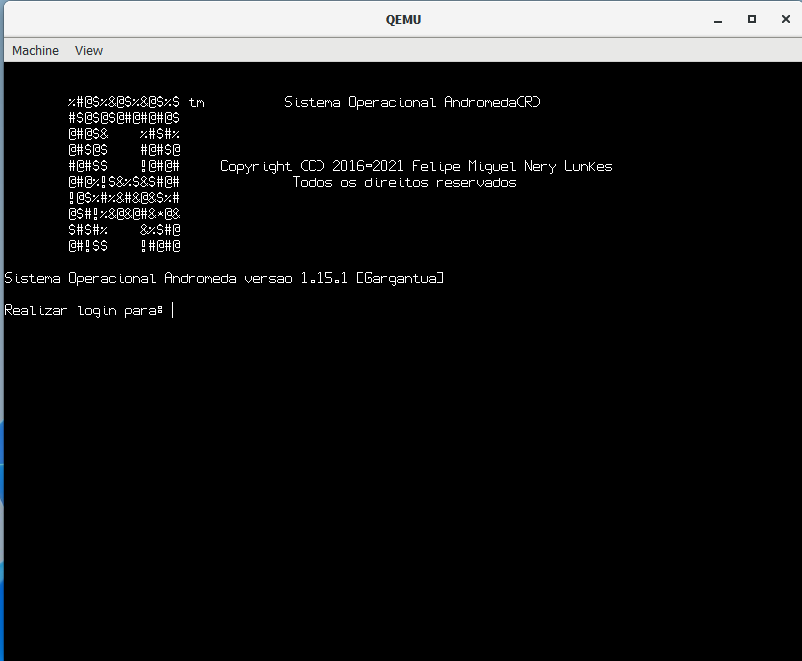
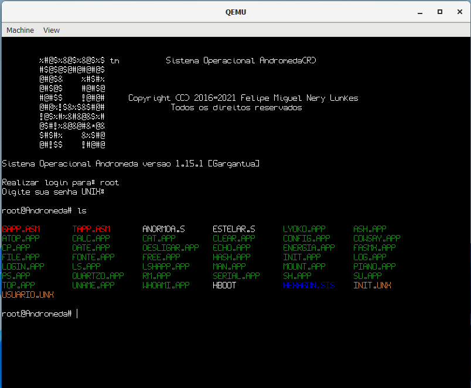
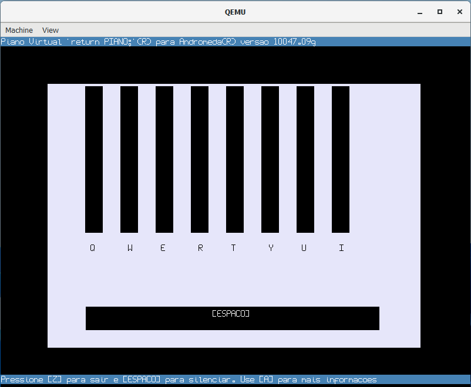
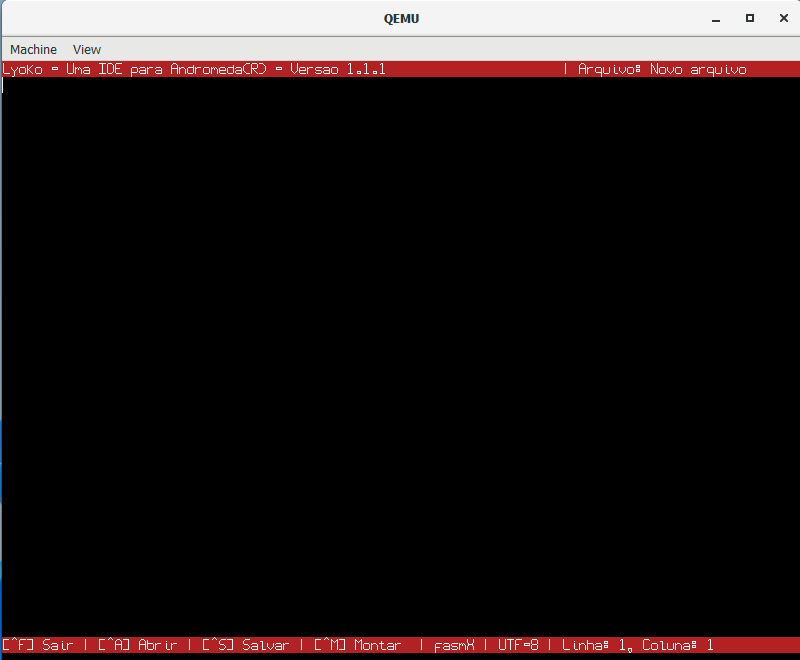
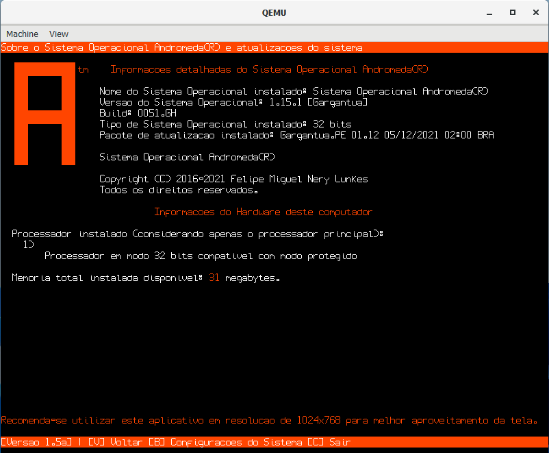
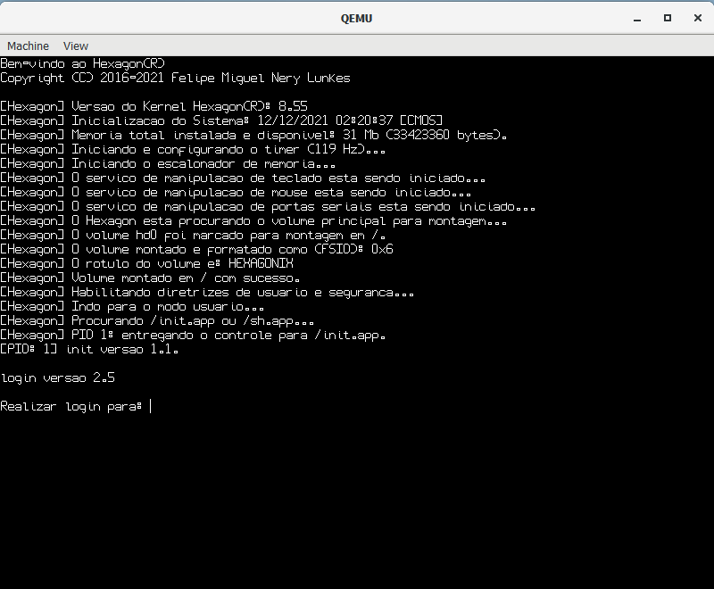
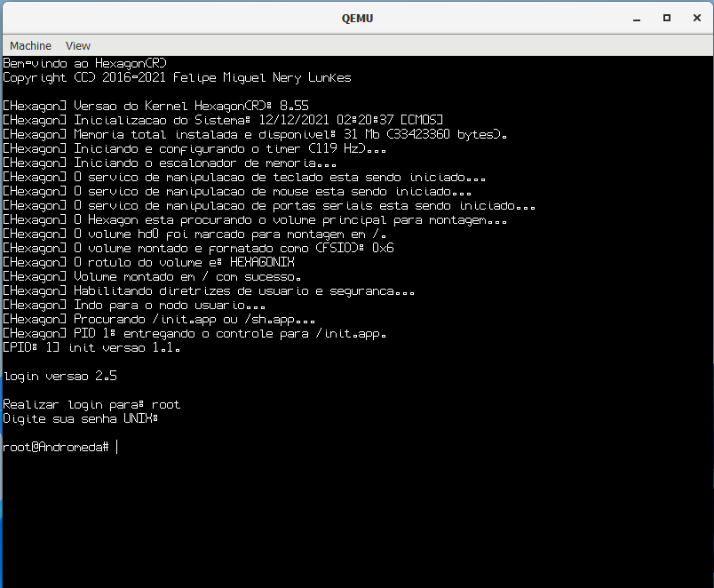

# Andromeda

<!-- Versão em português -->

# Sistema Operacional Hexagonix/Andromeda

Seja bem-vindo ao Sistema Operacional Hexagonix/Andromeda

## Notas de direitos autorais 

O Hexagonix/Andromeda foi desenvolvido do zero por [Felipe Lunkes](https://github.com/felipenlunkes).

Leia a [licença](LICENSE) para mais informações sobre direitos autorais, propriedade de código e redistribuição.

* Sistema Operacional Andromeda. Copyright © 2016-2022 Felipe Miguel Nery Lunkes. Todos os direitos reservados.
* Kernel Hexagon. Copyright © 2016-2022 Felipe Miguel Nery Lunkes. Todos os direitos reservados.
* Gerenciador de Boot Saturno. Copyright © 2016-2022 Felipe Miguel Nery Lunkes. Todos os direitos reservados.
* Hexagon Boot (HBoot). Copyright © 2020-2022 Felipe Miguel Nery Lunkes. Todos os direitos reservados.

## Antes de mais nada

No final deste arquivo você encontra um tutorial para executar o Hexagonix/Andromeda em seu computador, tanto em uma versão virtualizada como de forma nativa. Lembre-se que é necessário possuir um computador de arquitetura x86 ou um emulador, caso esteja utilizando um dispositivo de outra arquitetura para testes. 

* [Documentação do sistema (em construção)](https://github.com/hexagonix/Distro/tree/main/Doc)

# Sobre o sistema

## Desenvolvimento

O Hexagonix/Andromeda e todos os seus componentes vêm sendo desenvolvidos desde 2015 e foram escritos completamente em linguagem Assembly.

## Por que dois nomes? Hexagonix e Andromeda, o quê são?

No início, o Andromeda foi planejado para ser um sistema operacional completo, composto pelo kernel, bibliotecas, interface gráfica e de texto e utilitários. Mais tarde, com o passar do tempo e a mudança na abordagem da arquitetura e objetivos do sistema, os componentes foram separados e se tornaram projetos independentes a nível de funcionamento, organização e desenvolvimento. Como será possível observar a diante, o núcleo do Andromeda foi separado do restante da árvore de código do Andromeda, se tornando um projeto independente, recebendo até um nome, Hexagon. A partir de então, surgiu a ideia de flexibilizar a composição do sistema e permitir o desenvolvimento de distribuições, como ocorre no GNU/Linux. Desta forma, distribuições do Hexagon poderiam ser criadas, agrupando os componentes necessários para o funcionamento básico (Hexagonix) e permitindo a extensão do sistema caso seja necessário, com novos componentes, módulos e utilitários, sendo o userland definido a cada caso. Com a mudança de arquitetura do próprio sistema, com o núcleo se aproximando de uma arquitetura semelhante ao Unix, novos utilitários no estilo e sintaxe Unix foram desenvolvidos e mantidos separados, em um outro projeto. Do projeto Andromeda original temos os aplicativos e bibliotecas gráficas específicas do Andromeda. Foi então criado um sistema base, que por si só já pode ser executado plenamente, e se transformou na base do Andromeda. Esse sistema base se chama Hexagonix, e é composto pelo carregador de inicialização HBoot, pelo kernel Hexagon, pelo shell, bibliotecas de ambiente Unix (aqui denominado ambiente Hexagonix) e utilitários Unix. Esse sistema é plenamente funcional, mas carece de recursos gráficos e aplicativos desenvolvidos para o ambiente Andromeda. Dessa forma, o Andromeda se destaca por ser uma camada a mais construída sobre a base do Hexagonix, com recursos gráficos, uma biblioteca gráfica e utilitários que funcionam sobre o Hexagonix e estendem sua função. Esse ambiente construído foi nomeado de ambiente Andromeda. Para suprir diferentes necessidades, as duas distribuições serão sempre mantidas. Ambas as versões são funcionais e podem ser utilizadas, dependendo do uso final desejado. Em resumo, tanto o Hexagonix quanto o Andromeda são distribuições do kernel Hexagon, diferindo quanto aos componentes incluídos.

Para compreender melhor esse modelo de distribuição, um exemplo adequado seria o que ocorre com o macOS (Apple)[^1]. O macOS é um sistema operacional Unix-like constrúido sobre o Darwin, um sistema operacional livre composto pelo kernel XNU, bibliotecas e utilitários, adicionando sobre o Darwin a interface gráfica Aqua e demais aplicativos e utilitários desenvolvidos pela Apple e outros fornecedores. O ambiente Darwin é facilmente acessado e observado através do macOS, como na utilização do terminal, por exemplo. O Darwin é um sistema completo e funcional, mas carece de alguns recursos gráficos, por exemplo, que só são distribúidos juntamente ao macOS. Nessa analogia, temos o macOS como Andromeda e Darwin como Hexagonix. 

[^1]: Você pode obter mais informações sobre a relação entre o Darwin e o macOS aqui [(PT)](https://pt.wikipedia.org/wiki/Darwin_(sistema_operacional))[(EN)](https://en.wikipedia.org/wiki/Darwin_(operating_system)).
## E o código-fonte?

O código-fonte do projeto ainda não está disponível publicamente, mas há planos para a disponibilização no futuro. Entretanto, a distribuição das imagens de disco, tanto com o Hexagonix quanto com o Andromeda, é livre. Observe a [licença](LICENSE) disponível neste repositório para mais informações.

## O que é um sistema operacional?

O Sistema Operacional Hexagonix/Andromeda é uma coleção de peças de software que atua no gerenciamento do hardware do computador onde está instalado, permitindo o carregamento e funcionamento de aplicativos e a comunicação entre os diversos dispositivos conectados ao dispositivo. Ele é composto por vários componentes, que atuam no processo de inicialização do computador, testes de recursos e carregamento do kernel (núcleo) do sistema operacional, o núcleo, uma interface de interação com o usuário e uma série de utilitários.
Tanto o hexagonix quanto o Andromeda são distribuições que incorporam um kernel Unix-like, denominado Hexagon, bibliotecas de suporte, utilitários desenvolvidos exclusivamente para o ambiente Andromeda e utilitários Unix-like de linha de comando (estes últimos e o kernel Hexagon por si só já configuram um sistema operacional base, o Hexagonix).

## A história do Hexagonix/Andromeda:

O Andromeda começou como uma implementação em estrutura similar a sistemas do tipo DOS, com um interpretador com comandos internos com nomes, sintaxes e resultados semelhantes a um DOS genérico. O interpretador de comandos apresentava comandos de manipulação de arquivos e outros internamente, como em sistemas DOS convencionais. As unidades de disco também eram definidas como letras. Mais tarde, surgiu um interesse crescente e fascínio no funcionamento de sistemas Unix e todo o código foi reescrito ou adaptado para tornar o kernel do Sistema um kernel Unix-like. Todos os componentes do Sistema, assim como no DOS, eram mantidos em uma única árvore até então. Com a versão 1.5 do Andromeda, com nome de código "Unix-like", o kernel foi bastante modificado e reescrito para se adequar à filosofia Unix. As mudanças incluíram até mesmo a forma como os dispositivos eram tratados, com a escrita de uma camada de abstração de hardware com o gerenciamento de dispositivos como arquivos, além da adição das chamadas de sistema abrir(), fechar(), escrever() e ler(). Também foram escritos os utilitários base Unix, com a retirada de comandos do interpretador padrão, que foi reescrito para dar lugar a um shell Unix-like. Os camandos internos foram movidos para os utilitários, que passaram a contar com estrutura e sintaxe no estilo Unix. O restante dos utilitários, como mount, foi escrita, já tirando proveito da chamada abrir(), que também é utilizada para montar volume, além de abrir arquivos ordinários do volume. A chamada abrir() também é utilizada para iniciar outros periféricos, como portas seriais e paralelas. A chamada escrever() também funciona com dispositivos e arquivos, bem como fechar(). Foi também introduzido um VFS (Virtual File System), que suportará no futuro vários sistemas de arquivos e que torna transparente para o Sistema, programadores e usuários o gerenciamento de arquivos. Também foram incluídas novas funções de gerenciamento de hardware e muitos aprimoramentos e correções de bugs. O Sistema ganha novos utilitários Unix até o presente momento. Após essa alteração da proposta e arquitetura, os componentes foram separados e alocados em projetos específicos. A união destes componentes forma o sistema operacional. No caso do Hexagonix, temos o HBoot, Hexagon, shell, bibliotecas e aplicativos Unix, enquanto o Andromeda estende o Hexagonix, incorporando outras bibliotecas e aplicativos que as utilizam.

## Versionalização do Hexagonix/Andromeda:

O sistema operacional apresenta uma numeração de versão independente dos componentes associados. Cada componente, desde o gerenciador de inicialização, até um simples utilitário, recebem uma numeração de versão independente e que reflete seu estado de desenvolvimento. Um número de versão do Hexagonix/Andromeda apresenta três conjuntos de números divididos em três blocos separados por um caractere de ponto ".". O primeiro deles representa o número principal de versão e se baseia no número um. Já o segundo número se refere ao lançamento, este é o número que varia de um lançamento do Hexagonix/Andromeda para outro e distingue entre as grandes versões do Sistema, além de ser utilizado como número de versão que é verificado pelos aplicativos e utilitários para verificar se a versão do sistema apresenta os requisitos mínimos para a execução do software. Já o terceiro é o número de revisão de cada grande lançamento e, caso seja 0, pode ser omitido, ficando a versão com apenas dois blocos de algarismos. Um exemplo seriam as versões "1.14.4", cuja versão base é sempre 1, até o momento, 14 indica o lançamento (este se refere, na maioria das vezes, a real versão do Sistema. Pense, por exemplo, no sistema de numeração da Apple com o Mac OS X/OS X/macOS até a versão 11.0 Big Sur, que começa sempre com 10 e é seguido do número do lançamento e revisão). Já o número 4 seria a revisão dentro do grande lançamento, que diz respeito a correção de bugs e adição de alguma funcionalidade que não mude de forma profunda o Sistema nem o uso do mesmo.

Normalmente, o Hexagonix e o Andromeda apresentam a mesma numeração de versão principal, mas isso não é necessariamente obrigatório. Os números de versão podem divergir em algum momento, bem como os componentes de cada distribuição. A versão do Hexagon, por exemplo, pode ser diferente mesmo em números de versão idênticos, mas esse tipo de divergência será sempre evitada.

# Componentes do sistema

## Saturno

O primeiro componente do Hexagonix/Andromeda é o Saturno. Ele é responsável por receber o controle do processo de inicialização realizado pelo BIOS/UEFI e procurar no volume o segundo estágio de inicialização. Para isso, ele implementa um driver para leitura de um sistema de arquivos FAT16. O segundo estágio de inicialização (ver adiante) pode implementar drivers para outros sistemas de arquivos e é responsável por encontrar o Hexagon, carregar módulos HBoot ou carregar um sistema do tipo DOS compatível (versão BETA).

## Hexagon Boot (HBoot)

O Hexagon Boot (HBoot) é um componente desenvolvido permitir a inicialização do kernel Hexagon. Até então, a inicialização era realizada por apenas um estágio, que definia um ambiente bem básico, carregava o Hexagon na memória e imediatamente passava o controle para ele, fornecendo um conjunto bem pequeno e limitado de parâmetros, uma vez que o código desse estágio fica restrito a 512 bytes, o que limita a realização de diversos testes e processamento de dados. Como o HBoot, foi possível expandir o número de tarefas realizadas antes da execução do Hexagon, além da possibilidade de fornecer mais informações a respeito do ambiente da máquina e de inicialização. Isso é particularmente importante para permitir a criação de uma árvore de dispositivos que pode ser utilizada pelo Hexagon para decidir como manipular cada dispositivo identificado. O HBoot é capaz de verificar quais unidades de disco estão disponíveis na máquina, emitir um tom de inicialização, obter a quantidade de memória RAM disponível instalada e permitir ou não o seguimento do processo de boot de acordo com essa informação. Caso nenhuma interação do usuário seja detectada 3 segundos após todos os testes e atividades essenciais para criar um ambiente de inicialização para o Hexagon, o sistema irá carregar e executar o Hexagon (presente em um arquivo no volume nomeado de **HEXAGON.SIS**), sendo descarregado da memória. A interação com o HBoot se dá pelo pressionamento da tecla F8 após a respectiva mensagem surgir na tela. 

### Outras funções disponíveis

* O HBoot permite o carregamento de módulos no formato HBoot, que podem ser úteis, no futuro, para permitir testes de hardware, como testes de memória e disco, caso os módulos estejam disponíveis no disco. Os módulos podem ser utilizados também para extender as funções do HBoot. A especificação do formato já está disponível e um exemplo pode ser encontrado abaixo. Esses módulos podem ser utilizados para testar dispositivos específicos, obter informações do hardware ou carregar arquivos em sistemas de arquivos não suportados originalmente pelo HBoot.
* No contexto do desenvolvimento do Hexagonix, o HBoot também pode carregar diretamente, a partir de um módulo atualmente built-in (essa função será movida para um módulo standalone o quanto antes) o núcleo do sistema operacional de código livre FreeDOS[^2], para que ferramentas utilitárias já estabelecidas e robustas que sejam executadas em ambiente DOS possam ser executadas sobre o volume e arquivos Hexagonix/Andromeda. O FreeDOS foi escolhido devido a sua característica de kernel composto por um único arquivo, geralmente "KERNEL.SYS"[^3], além da sua distribuição livre e gratuita. Já outros DOS, como o MS-DOS, anterior a versão 7.0, utilizam dois arquivos que devem estar contíguos no disco, e isso não é possível aqui, visto que a instalação do FreeDOS ocorre já em um volume Hexagonix, com a cópia do kernel, interpretador de comando e outros utilitários DOS, sendo que o sistema operacional principal é o Hexagonix/Andromeda, com iniciação opcional do FreeDOS para alguma atividade em especial[^4]. Caso os componentes de sistema do FreeDOS não estejam presentes no disco (a cópia dos arquivos do FreeDOS não faz parte da imagem padrão), a inicialização em modo de compatibilidade DOS não irá ocorrer.

[^2]: Você pode encontrar a página do projeto [aqui](https://www.freedos.org/).
[^3]: A inicialização em modo DOS foi possível após pesquisa na documentação do FreeDOS, especialmente no arquivo "SYS.C" (que pode ser encontrado [aqui](http://www.ibiblio.org/pub/micro/pc-stuff/freedos/files/dos/sys/2043/)), que indica em qual segmento o kernel espera ser carregado e quais os parâmetros são necessários. Cada sistema DOS apresenta um segmento de carregamento preferencial e esse carregamento de outras edições do DOS pode ser implementada futuramente com o auxílio dos módulos HBoot. Todo o código para o carregamento do núcleo foi desenvolvido do zero e não se baseia em algum existente.
[^4]: A iniciação em modo de compatibilidade DOS do HBoot pode ser útil para rodar ferramentas de verificação de erros no volume, desfragmentação do volume, particionador e outras ferramentas de diagnóstico, bem como de desenvolvimento, como compiladores e montadores que não são suportados pelo Hexagonix/Andromeda (as ferramentas de 16 bits, por exemplo).

### Exemplo de módulo HBoot

Abaixo é possível encontrar um exemplo de implementação de módulo HBoot:

```assembly
;;************************************************************************************
;;
;;    
;;                                Módulo do HBoot
;;        
;;                             Hexagon® Boot - HBoot
;;           
;;                 Copyright © 2020-2021 Felipe Miguel Nery Lunkes
;;                         Todos os direitos reservados
;;                                  
;;************************************************************************************

use16					

;; O módulo deve apresentar um cabeçalho especial de imagem HBoot
;; São 6 bytes, com assinatura (número mágico) e arquitetura alvo

cabecalhoHBoot:

.assinatura:  db "HBOOT"     ;; Assinatura, 5 bytes
.arquitetura: db 01h         ;; Arquitetura (i386), 1 byte

;; Configurar pilha e ponteiro

    cli				   ;; Desativar interrupções
    
    mov ax, 0x2000                 ;; Definir aqui os registradores de pilha
    mov ss, ax
    mov sp, 0
    
    sti				   ;; Habilitar interrupções
     
    clc 

    mov ax, 0x2000                 ;; Definir aqui os registradores de segmento
    mov ds, ax
    mov es, ax
    
    sti                            ;; Habilitar as interrupções

;; Seu código aqui

```

### Sistemas de arquivos suportados

* FAT16B
* FAT12 (em desenvolvimento)

Novos sistemas de arquivos serão implementados no futuro.

### Reportar bugs

O HBoot ganhou muita complexidade desde o início de seu desenvolvimento, em 2020. Devido a esse aumento de código e a natureza de sua operação (16-bit), bugs podem ser encontrados. Os mesmos podem ser reportados no repositório ou por email, disponível no final deste arquivo.

## Kernel Hexagon

### O que é

O Hexagon é um núcleo (kernel) monolítico executado em modo protegido 32-bit, desenvolvido tendo como alvo a arquitetura PC (x86). É um kernel escrito do zero, visando a velocidade e a compatibilidade de harware moderno mas também sendo capaz de ser executado em hardware mais antigo. No momento, garante um ambiente monoutilizador, apesar do uso de terminais virtuais, e monotarefa, apesar da capacidade de carregar, manter em memória e controlar mais de um processo, em uma pilha de execução de ordem cronológica. Futuramente o kernel poderá receber suporte a execução de múltiplos processos em multitarefa preemptiva. O Hexagon é um kernel Unix-like e compõe a base do Sistema Operacional Hexagonix/Andromeda, embora independente deste. Ele executa imagens executáveis no formato HAPP, desenvolvido para o Hexagon. Implementa uma API bastante sofisticada acessível através de uma chamada de sistema.

### História

O kernel foi inicialmente desenhado e escrito visando uma estrutura e funcionamento próximos de sistemas DOS (Disk Operating System), como MS-DOS, nos ano de 2015 a 2017. Sendo assim, muitas chamadas de sistema e nomes de dispositivo seguiam uma sintaxe e nomes DOS. Com o passar do tempo, houve o interesse de aproximar o então núcleo do Andromeda, que a essa altura não possuia nome e era mantido junto ao código da distribuição, a uma estrutura e funcionamento mais próximos de sistemas do tipo Unix, como BSD ou Linux, por exemplo. Desta forma, muitas partes do kernel foram reimplementadas tendo em mente o novo objetivo. O código do núcleo foi separado do restante do Sistema e se tornou independente, em questão de desenvolvimento e também de funcionamento, além de ganhar um nome, Hexagon. Foi escrita uma camada de abstração de hardware com a inclusão de chamadas de sistema conhecidas no mundo Unix, como abrir(), fechar(), ler() e escrever(). Os dispositivos ganharam nome e as unidades de disco mudaram da nomenclatura DOS e foram para nomes de dispositivo Unix. O kernel então passa a seguir um processo de inicialização conhecido, com a execução, com PID 1, do primeiro processo do usuário, init, que então carrega o restante dos componentes. Foram então escritos utilitários Unix-like que passassem a utilizar a API Unix-like do kernel, e várias ferramentas Unix-like já foram escritas desde então (2017 em diante).

### O formato executável HAPP

O formato de imagem executável HAPP foi desenvolvida para o Hexagon para permitir o desenvolvimento de imagens que possam ser verificadas e validadas quanto a arquitetura e versões mínimas do kernel necessárias para a correta execução. O cabeçalho também armazena informações importantes, permitindo ao desenvolvedor adicionar diretamente um ponto de entrada, independente de onde ele esteja no interior da imagem, algo que deveria ser redirecionado anteriormente, quando a imagem executável era no formato binário puro. A imagem HAPP também permite validar se a imagem a ser carregada é realmente uma imagem executável, impedindo então que arquivos não suportados sejam executados, mesmo que não se tratem sequer de arquivos executáveis. Também permite que o sistema verifique as dependências do código, como a já citada arquitetura, bem como os números de versão do Hexagon, que devem ser iguais ou superiores ao mínimo especificado pelo cabeçalho. Todas as imagens HAPP devem apresentar este cabeçalho completo, incluindo as sessões reservadas, a fim de funcionarem corretamente em versões posteriores do Sistema. As imagens HAPP são sempre 32-bit.

Em linguagem Assembly, a linguagem de desenvolvimento do sistema, o cabeçalho, em sua especificação 2.0:

```assembly
cabecalhoAPP:

.assinatura:      db "HAPP" ;; Assinatura
.arquitetura:     db 01h    ;; Arquitetura (i386 = 01h)
.versaoMinima:    db 8      ;; Versão mínima do Hexagon
.subversaoMinima: db 40     ;; Subversão mínima do Hexagon
.pontoEntrada:    dd        ;; Offset do ponto de entrada (referência à função principal aqui)
.tipoImagem:      db 01h    ;; Tipo de imagem executável (executável = 01h)
.reservado0:      dd 0      ;; Reservado (Dword)
.reservado1:      db 0      ;; Reservado (Byte)
.reservado2:      db 0      ;; Reservado (Byte)
.reservado3:      db 0      ;; Reservado (Byte)
.reservado4:      dd 0      ;; Reservado (Dword)
.reservado5:      dd 0      ;; Reservado (Dword)
.reservado6:      dd 0      ;; Reservado (Dword)
.reservado7:      db 0      ;; Reservado (Byte)
.reservado8:      dw 0      ;; Reservado (Word)
.reservado9:      dw 0      ;; Reservado (Word)
.reservado10:     dw 0      ;; Reservado (Word)
```

Abaixo, uma implementação de um pequeno aplicativo escrito como exemplo, que utiliza o cabeçalho e chamadas de sistema do Hexagon, escrito em linguagem Assembly x86 em sintaxe Intel e montada com o auxílio do flat assembler (FASM). Este aplicativo envia uma mensagem ao terminal e se encerra em seguida.

```assembly
;; Este é um template para a construção de um app de modo texto para 
;; o Hexagonix/Andromeda!
;;
;; Escrito por Felipe Miguel Nery Lunkes em 04/12/2020
;;
;; Voce pode gerar uma imagem HAPP executável utilizando o montador
;; FASM. Para isso, utilize a linha de comando abaixo:
;;
;; fasmX tapp.asm
;;       ou
;; fasmX tapp.asm tapp.app

use32

cabecalhoAPP:

.assinatura:      db "HAPP"    ;; Assinatura
.arquitetura:     db 01h       ;; Arquitetura (i386 = 01h)
.versaoMinima:    db 8         ;; Versão mínima do Hexagon
.subversaoMinima: db 40        ;; Subversão mínima do Hexagon
.pontoEntrada:    dd inicioAPP ;; Offset do ponto de entrada
.tipoImagem:      db 01h       ;; Imagem executável
.reservado0:      dd 0         ;; Reservado (Dword)
.reservado1:      db 0         ;; Reservado (Byte)
.reservado2:      db 0         ;; Reservado (Byte)
.reservado3:      db 0         ;; Reservado (Byte)
.reservado4:      dd 0         ;; Reservado (Dword)
.reservado5:      dd 0         ;; Reservado (Dword)
.reservado6:      dd 0         ;; Reservado (Dword)
.reservado7:      db 0         ;; Reservado (Byte)
.reservado8:      dw 0         ;; Reservado (Word)
.reservado9:      dw 0         ;; Reservado (Word)
.reservado10:     dw 0         ;; Reservado (Word)

;;*************************************************************

include "andrmda.s" ;; Incluir as chamadas de sistema

;;*************************************************************

;; Variaveis e constantes

msg: db 10, 10, "Este e um template com um exemplo de aplicativo HAPP simples!", 10, 0

;;*************************************************************

;; Ponto de entrada

inicioAPP:

    mov esi, msg

    imprimirString ;; Aqui temos um macro que configura e chama uma função da API

    Andromeda encerrarProcesso ;; Outro macro que solicita qual chamada realizar
``` 

Uma documentação mais detalhada do Hexagon será disponibilizada no futuro.

## Ambiente Hexagonix:

O Hexagonix implementa, junto ao Hexagon, uma série de utilitários Unix-like, com funcionalidade e sintaxe de uso semelhante à sistemas UNIX e Unix-like. **Utilitários como init, login, sh, top, ps, cp, rm, cat, clear, man, dentre outros, estão inclusos na distribuição padrão do Hexagonix**. Estes utilitários compõem o pacote de utilitários base do Hexagonix. As ferramentas de inicialização de ambiente de modo usuário e login estão neste pacote, bem como vários arquivos de configuração deste ambiente. Estes utilitários não apresentam, no geral, uma interface gráfica, apenas uma interface em linha de comando (CLI). Entretanto, podem ser solicitados por aplicativos que apresentem interface gráfica. Este ambiente está disponível tanto na distribuição do [Hexagonix](hexagonix.img) quanto na distribuição [Andromeda](andromeda.img).

### Alguns aplicativos e utilitários do ambiente Hexagonix

O Hexagonix inclui muitos dos utilitários Unix que você pode já estar familiarizado, como por exemplo:

* init
* login
* ls
* cat
* cp
* rm
* clear
* top
* ps
* man
* su
* sh (shell padrão)
* uname
* whoami, entre outros.

### Aplicativos de terceiros disponíveis para o Hexagonix

* [Flat Assembler (fasm)](https://flatassembler.net/index.php)

O Hexagonix recebeu um port do montador [Fasm](https://flatassembler.net/index.php), que foi adaptado para o Hexagonix, permitindo ao usuário desenvolver aplicativos diretamente no sistema. As alterações adicionadas ao código, assim como licença do software, podem ser encontradas no [repositório do fasm para o Hexagonix](https://github.com/hexagonix/fasm). Este repositório é um fork do [repositório original](https://github.com/tgrysztar/fasm). O código adicionado é baseado em modificações realizadas do código original e adições autorais. Esse código modificado/autoral pode ser encontrado no repositório, [clicando aqui](https://github.com/hexagonix/fasm/tree/master/SOURCE/HEXAGONIX).
 
## Ambiente Andromeda:

O ambiente Andromeda é construído sobre a base sólida fornecida pelo Hexagonix, incluindo aplicativos e utilitários que não implementam a filosofia Unix ou apresentam sintaxe e forma de uso bastante diferentes do que se esperaria de um ambiente Unix. Desta forma, eles são separados como **aplicativos Andromeda**, e não fazem parte da distribuição padrão do Hexagonix. Aqui estão o aplicativo de configurações do Sistema, calculadora, gerenciador de fontes, editores de texto e a IDE desenvolvida para o Andromeda. Estes utilitários podem ou não apresentar uma interface gráfica. Juntamente a eles, compõem o ambiente Andromeda bibliotecas desenvolvidas para permitir o desenvolvimento de aplicativos, como a biblioteca **Estelar**. Esse ambiente só está disponível na distribuição [Andromeda](andromeda.img).

### Alguns aplicativos e utilitários do ambiente Andromeda

* Configurações do Sistema (Config)
* Editor de texto Quartzo
* IDE Lyoko para desenvolvimento de aplicativos
* Piano eletrônico return Piano;
* Utilitário de comunicação serial
* Andromeda Shell (ASH) - Um novo shell para o Andromeda
* Calculadora do Andromeda
* Utilitário de alteração de fonte
* Utilitário de desligamento do Andromeda

### Aplicativos de terceiros disponíveis para o Andromeda

Ainda não existem aplicativos de terceiros disponíveis para o ambiente Andromeda. Caso esteja interessado, você pode construir o primeiro!

## Fontes do Hexagonix:

A instalação padrão do Hexagonix também fornece uma série de fontes que podem ser carregadas pelo aplicativo de configurações ou utilitário de fontes (gerenciador de fontes). Esses arquivos são utilizados para alterar a fonte de exibição em modo gráfico do Hexagonix e Andromeda.

# Bibliotecas de desenvolvimento do sistema:

O Hexagonix/Andromeda também fornece funções que devem ser utilizadas para interagir com o próprio ambiente do sistema. As bibliotecas são utilizadas para acessar funções implementadas pelo Hexagon ou pelas próprias bibliotecas, permitindo o desenvolvimento facilitado de aplicativos e utilitários tanto para o ambiente Hexagonix quanto para o Andromeda. As bibliotecas implementam funções para exibição de texto, cálculos matemáticos, envio de mensagens, abertura de arquivos e dispositivos e muito mais. A biblioteca básica (andrmda.s ou hexagonix.s) fornecem funções acessíveis para ambos os ambientes possíveis de distribuição, enquanto outras bibliotecas podem ser exclusivas do ambiente Andromeda. Essas bibliotecas incluem funções gráficas para montar interfaces em modo gráfico (Andromeda), bem como funções para verificar a versão do sistema atualmente em execução (Hexagonix e Andromeda). Os utilitários base Hexagonix realizam a checagem da versão do Hexagon para verificar se podem ser executados, utilizando o utilitário Unix uname ou diretamente por uma chamada de sistema do Hexagon.

# Um pouco sobre a inicialização do sistema:

Após a inicialização do firmware, o BIOS [(PT)](https://pt.wikipedia.org/wiki/BIOS) [(EN)](https://en.wikipedia.org/wiki/BIOS) ou outro firmware, como UEFI [(PT)](https://pt.wikipedia.org/wiki/Unified_Extensible_Firmware_Interface) [(EN)](https://en.wikipedia.org/wiki/Unified_Extensible_Firmware_Interface) em modo legado, realiza a busca de um volume/disco marcado como inicializável e, ao encontrar, carrega o primeiro setor para o endereço 0x7C00. No caso de um volume Hexagon, no primeiro setor do volume está localizado o componente denominado Saturno. Saturno é o gerenciador de inicialização MBR de um volume Hexagon e atua como primeiro estágio na cadeia de carregamento do Sistema. Ele realiza a procura, no volume, do segundo estágio, bem mais robusto, o Hexagon Boot (HBoot). O HBoot não apresenta as mesmas limitações do componente anterior, uma vez que não está restrito ao tamanho de 512-bytes. Ao iniciar, o HBoot realiza uma série de testes e diagnósticos da máquina, verificando quais discos/volumes estão disponíveis na máquina, qual a quantidade de memória RAM instalada e inicializando alguns periféricos, como portas seriais, além de verificar o processador instalado quanto a sua capacidade de executar o Hexagon. Caso a quantidade de memória RAM instalada seja menor que o mínimo, o processador não seja suportado ou ocorra algum erro em algum periférico essencial, a protocolo de inicialização é cancelado. Caso os testes sejam bem sucedidos, ocorre a procura, no volume, do arquivo que contêm o kernel Hexagon, com seu carragamento, construção de uma estrutura de parâmetros, configuração de registradores com informações básicas de hardware e posterior execução. O HBoot também é capaz de carregar e executar módulos no formato HBoot, bem como iniciar um sistema do tipo DOS cujos arquivos estejam presentes no volume Hexagon (até o momento, apenas o FreeDOS é suportado). Também é capaz de realizar alguns testes de hardware sob demanda, como som e gráficos. Após o carregamento do Hexagon, o kernel recebe o controle do dispositivo e realiza a configuração dos periféricos, constrói estruturas internas de controle e inicia o primeiro processo de usuário, com PID 1, normalmente o Inicializador do Sistema, ou init. O init irá ler o arquivo de configuração "INIT.UNX" no volume e iniciar os serviços lá descritos, geralmente o Gerenciador de Login e Usuários, ou simplemente login. Este, por sua vez, busca as informações em "USUARIO.UNX" e as compara com as entradas do usuário, e, caso as credenciais sejam válidas, inicia o primeiro shell ou utilitário descrito na entrada de usuário. Após, o Hexagon entra em modo administrativo e gerencia requisições dos aplicativos e periféricos, expondo a API para construção e execução dos demais componentes do Sistema (para mais informações, consulte o arquivo de cabeçalho "ANDRMDA.S", que já documenta a API).

# Como testar o Hexagonix ou o Andromeda:

## Requisitos do sistema

### Requisitos mínimos

* Processador: Pentium III (1999) com suporte a SSE e MMX ou mais recente;
* Memória RAM: 32 Mb mínimo (uma instalação mínima com 32 Mb costuma ser suficiente, na maioria dos casos);
* Disco rígido: disco rígido IDE ou SATA com mínimo de 50 Mb;
* Periféricos necessários:
  - Porta serial (1-4);
  - Porta paralela (1-4);
  - Teclado PS/2 ou USB;
  - Placa de vídeo VGA com 2 Mb de memória de vídeo (com suporte a cores).

### Recomendado

* Processador: Pentium D ou mais recente;
* Memória RAM: 50 Mb;
* Periféricos opcionais:
  - Mouse PS/2 ou USB;
  - Placa de vídeo com > 2 Mb de memória de vídeo.

## Obter as imagens de disco com a instação do sistema 

Para testar o Hexagonix ou Andromeda, você vai precisar de uma das imagens de disco disponíveis neste repositório, bem como a ferramenta [qemu](https://www.qemu.org) instalada em seu computador. A imagem também pode ser utilizada para a gravação em um disco físico em uma máquina real. 

Para testar o Hexagonix, obtenha o arquivo ['hexagonix.img'](hexagonix.img) neste repositório.
Para testar o Andromeda, obtenha o arquivo ['andromeda.img'](andromeda.img) neste repositório.

## Para o teste em ambiente virtualizado

Você deve fornecer ao menos 32 MB de RAM para a máquina virtual. Normalmente, a linha de comando abaixo cumpre todos os requisitos para a execução do sistema:

```
qemu-system-i386 -hda andromeda.img -m 32 -soundhw pcspk
qemu-system-i386 -hda hexagonix.img -m 32 -soundhw pcspk
```

Lembrando que você deve utilizar uma versão/edição do qemu que consiga executar software escrito para a arquitetura x86. Para realizar o download e instalação do qemu, clique [aqui](https://www.qemu.org/download/).

## Para teste em máquina física

Você deve utilizar o Linux/macOS ou alguma ferramenta Windows que te permita gravar essa imagem em disco.

No Linux/macOS/Unix, use a linha abaixo:

```
dd if=andromeda.img of=/dev/unidade
```
onde unidade equivale ao dispositivo desejado. Reinicie seu computador e teste o sistema. Vale lembrar que o modo de boot seguro não é suportado, além de que o boot só é suportado em BIOS ou no modo legado BIOS do UEFI.

# Capturas de tela do sistema

## Andromeda







Você pode ver mais [aqui](https://github.com/hexagonix/Distro/tree/main/Img).

## Hexagonix





Você pode ver mais [aqui](https://github.com/hexagonix/Distro/tree/main/Img).

# Idiomas

Neste momento, tanto o sistema quanto a documentação estão disponíveis apenas em português. O documentação em inglês estará disponível em breve, e há planos para suporte ao inglês como possibilidade de idioma principal, além do português (grande parte do trabalho já foi feita).

# Autor & contato

* [Felipe Miguel Nery Lunkes](https://github.com/felipenlunkes)

Sinta-se a vontade de me contatar, reportar bugs ou se interessar em participar do projeto.

## E-mail:

* hexagonixdev@gmail.com (PT/EN) 
* felipemiguel_nery@hotmail.com (PT/EN)

## Redes sociais:

* [Twitter](https://twitter.com/redLipes)

Versão deste arquivo: 3.4

<!-- Versão em inglês 


-->

